# 项目——豆瓣电影Top250的短评分析

> Scrapy 爬虫 + 数据清理 + 数据分析 + 构建情感分析模型

- [一、爬取豆瓣Top250的短评数据](#一爬取豆瓣top250的短评数据)
    - [movie_item](#movie_item)
    - [movie_comment](#movie_comment)
    - [movie_people](#movie_people)

- [二、数据清理与特征工程+统计分析](#二数据清理与特征工程统计分析)

    - [movie_item](#movie_item-1)

		- [总评分最高的前10部电影](#1-总评分最高的前10部电影)
		- [最受欢迎的电影类别排名](#2-最受欢迎的电影类别排名)
		- [最受欢迎的电影出品国家排名](#3-最受欢迎的电影出品国家排名)
		- [最受欢迎的电影导演排名](#4-最受欢迎的电影导演排名)
		- [最受欢迎的电影演员排名](#5-最受欢迎的电影演员排名)
		- [最受欢迎的电影语言排名](#6-最受欢迎的电影语言排名)
		- [根据电影时长的电影排名](#7-根据电影时长的电影排名)
		- [根据电影投票数的电影排名](#8-根据电影投票数的电影排名)
		- [根据电影评价数的电影排名](#9-根据电影评价数的电影排名)
		- [根据电影提问数的电影排名](#10-根据电影提问数的电影排名)
		- [根据电影发布时间的规律](#11-根据电影发布时间的规律)
		- [1~5星级投票的百分比](#12-15星级投票的百分比)
		- [电影简介的情感分析](#13-电影简介的情感分析)
	
    - [movie_comment](#movie_comment-1)
    
		- [就肖申克的救赎这个电影而言](#1-就肖申克的救赎这个电影而言)
		
			- [短评词云](#短评词云)
			- [用朴素贝叶斯完成中文文本分类器](#用朴素贝叶斯完成中文文本分类器)
			- [用svc完成中文文本分类器](#用svc完成中文文本分类器)
			- [用facebook-fasttext有监督完成中文文本分类](#用facebook-fasttext有监督完成中文文本分类)
			- [用facebook-fasttext无监督学习](#用facebook-fasttext无监督学习)
			- [用cnn做中文文本分类](#用cnn做中文文本分类)
			- [用rnn做中文文本分类](#用rnn做中文文本分类)
			- [用gru来完成中文文本分类](#用gru来完成中文文本分类)

		- [全部影片的短评数据分析](#2-全部影片的短评数据分析)

    - [movie_people](#movie_people-1)
    	1. [短评人常居地按照国家分布](#1-短评人常居地按照国家分布)
    	2. [中国短评人常居地按照省份分布](#2-中国短评人常居地按照省份分布)
    	3. [每个短评人的被关注数与好友数](#3-每个短评人的被关注数与好友数)
    	4. [中国短评人的被关注数和好友数的人均地域分布](#4-中国短评人的被关注数和好友数的人均地域分布)
    	5. [根据点评人个人简介构建中文文本分类模型](#5-根据点评人个人简介构建中文文本分类模型)

- [三、movie_item + movie_comment + movie_people](#三movie_item--movie_comment--movie_people)
    - [三个数据集间的协同分析](#三个数据集间的协同分析)
    - [通过短评来预测被评价电影是什么类型](#通过短评来预测被评价电影是什么类型)

- [小结](#小结)


> - 项目要求：
>   1. **爬取**豆瓣Top250 or 最新电影(例如战狼2、敦刻尔克、蜘蛛侠、银魂)的短评数据，保证抓取尽量完整；
>   2. **分析**大家的**短评用词**，分析 总体/分词性 的核心词，通过**可视化**方式展示；
>   3. **统计分析**电影的打分分布状况、右侧有用的分布、点评量随时间的变化、点评人常居地的分布等，并用可视化的方式展示；
>   4. 通过评分与短评数据，构建**情感褒贬分析分类器**，通过短评数据预测用户“喜欢”or“不喜欢”电影。
>
> 注：**其他**的有意义的分析和建模，有**加分**！
>
> - 提交要求：
>   - 根据project步骤，有任务子文件夹
>   - 根据project要求，建立相关文件夹与readme文档
>   - 学员应在readme文档中对自己的思路与各文件进行注释
>
>


- 项目总目标：
  - 尽可能完备的爬取与短评相关的信息，足够完备的给出所有分析。


- 项目分步目标：
  - 爬取豆瓣Top250电影站点中三类数据：每个电影详情信息、每个电影的短评内容和每个短评背后点评人的个人信息。
  - 给每个数据集，分别完成统计分析、构建中文文本情感分析模型。

  - 三个数据集交叉的统计分析，并构建中文文本深度学习模型。

  

- Idea：

  - 对每个数据集单独做一个统计分析：
    - 250电影的纵向对比：最受欢迎（前10）的电影（根据豆瓣？总评分？）／电影类别（按出现频次）／导演（按出现频次）／演员（按出现频次）／语言（按出现频次，可以对其根据**分类？）／出品国家（按出现频次，可以对其根据大洲分类）／电影时长（按出现频次，可以对其分段，看不同段的直方图）；所有电影的发布时间分布，以观察什么年代的电影最受欢迎（可以对其分段）；在发布时间基础上，对比总评分／评价数／提问数的分布；以及，上述三者之间的分布依赖关系。从电影简介中分析情感关键词，看其与电影类别的关联、与导演的性格关联、与演员的关联。
    - 所有短评的统计分析：对每个电影爬取的短评量大致分布均匀；取前10电影，分别观察，短评喜欢和不喜欢为label构建模型。
    - 对点评人的常居地可视化；查看活跃的点评人（高关注数和好友数）的地理分布；点评人的个人简介中蕴含的特征词信息与地域的分布。
  - 多个数据集综合分析：
    - 各个电影的信息与其所有短评之间的关联，如根据短评判断电影的是喜剧片还是犯罪片。
    - 各个点评人的信息与其所发出的所有短评之间的关联，如通过短评判断点评人的常居地。
    - 构造模型，给定某电影信息和点评人信息，推断其会如何短评。


## 一、爬取豆瓣Top250的短评数据


首先，建立Scrapy爬虫project，名为“douban_movie”。

在完成整个的结业项目过程中，绝大部分时间都花在了豆瓣电影的爬虫上，其中大部分时间都花在防止403被ban或者爬取足够数目的items上。

关于Scrapy代码的细节和考虑可见douban_movie文件夹中的[README](./douban_movie/README)文件，其中会详述如何运行scrapy爬虫以及其中考虑到过的细节。

概要地说，所有的spider文件都设置独立的pipeline输出文件到`./douban_movie/data`中，并且除了`movie_item`，都各自自定义了downloadpipeline参数`'DOWNLOAD_DELAY': 1.8, `，以确保不会立马被ban。每个spider的爬取都是先login，然后跳转到目标解析URL来进行的；另为了提高爬取速度，对spiders做了DNS缓存，详情可见文件`./douban_movie/dns_cache.py`和spider文件中调用的`_setDNSCache()`函数；虽然书写了多个spiders并行爬取的代码，但是在实际的爬取过程中是采用部分spiders并行工作的，一般是2-3个spiders并行工作，以免被ban，详情查看文件`./douban_movie/setup.py`和文件夹`./douban_movie/commands/`。

在settings中，使用了faker代理：

```python
from faker import Factory
f = Factory.create()
USER_AGENT = f.user_agent()
```

还设置了尽量使用宽度优先的策略 `SCHEDULER_ORDER = 'BFO'`；最大requests数一口气设置到了1000:`CONCURRENT_REQUESTS = 1000` ；为了保证爬取状态下的页面整洁：`LOG_LEVEL = 'INFO'`；

对于爬取douban_people的时候，设置了无头浏览器缓冲加载，因为豆瓣短评人的网页上，目标要爬取信息是动态JS的。其设置的详情可见`./douban_movie/middlewares.py`，在这个文件中，指定了phantomjs的执行目录。

总体上，我的目标是爬取三大类信息：

- Top250电影的信息（文件位于：`./douban_movie/data/movie_item.json`）
- Top250电影中短评的信息（文件位于：`./douban_movie/data/movie_comment*.json`）
- 每个短评所对应的用户信息（文件位于：`./douban_movie/data/movie_people*.json`）

在实际的爬取过程中，先爬取Top250电影信息，输出数据文件`movie_item.json`，从中再切出每个电影的`movie_id`存到`./bin/movie_id.out`中。再爬取每个电影的前50页短评信息，根据`movie_id.out`文件，直接构造出每个电影的短评URL地址来爬取短评信息，输出数据文件`movie_comment*.json`，再从中切出每个不重复的点评人的URL地址，存到`./bin/people_url.out`中。最后根据`people_url.out`文件，再爬取其中每个URL中的目标信息。

上述关于写入文件的关键代码，如下所示：

```python
people_url = data.people_url.values.tolist()
np.savetxt('people_url.out', people_url, fmt='%s')
```


### movie_item

`movie_item.json` 中是爬取Top250每个电影的信息，其中包括的item有19个，其中`movie_id`是每个电影的唯一ID编码。下面是一个实例，红色线中即是爬取的目标信息：

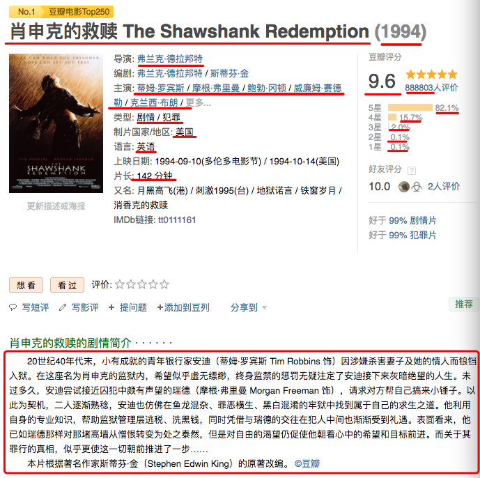


详情可见`./douban_movie/douban_movie/items.py`，也可预览下图：

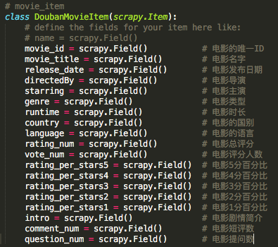

值得说明的是，实际爬取下来的信息中，仅246个电影的信息是全面，另4个电影是木有网页信息的。

另外，没有爬取“编剧”和“上映日期”，前者是因为自己觉得此特征可能用处不大，应该没有多少人看电影会关注编剧是谁吧，后者是遗憾的没有爬取到，只爬取了上映的年份日期。

### movie_comment

`movie_comment*.json` 中是爬取了246个电影中，每个电影短评的前50页，约有2000条短评。这样的考虑的原因有如下几点：

1. 绝大部分电影的短评数量非常庞大，基本都在2w以上，完全爬取并不现实；
2. 豆瓣电影短评的排名是基于豆瓣官方的某种算法排序的——“ 短评的排序是将豆瓣成员的投票加权平均计算后的结果，通过算法的调校，更好地反映短评内容的价值。”；
3. 查看短评的排序，可以发现短评有用数基本是指数递减的；

除了爬取了**短评文本信息**外，还收集了其他含有价值的items信息，包括**短评评分**、**短评有用数**和**短评时间**，其中前两者分别是分类有序和数值有序信息。下图是一个实例：

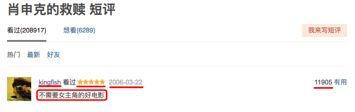

详情可见`./douban_movie/douban_movie/items.py`，也可预览下图：

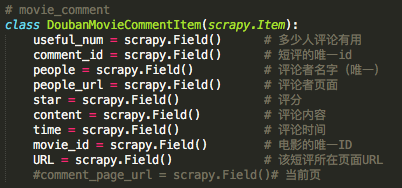

值得说明的是，items中`comment_id`是每条短评的唯一ID编码，`people`是每个短评人的用户名，可作为点评人的唯一ID编码。

实际爬取的过程中，由于代码要求先存下来每个电影的短评URL，然后同时批量每页爬取，很可能是截止到短评第50页的代码存在bug，而导致246个电影的短评数量并不是完全一样的，每个电影的短评数从1060到819不等分布：

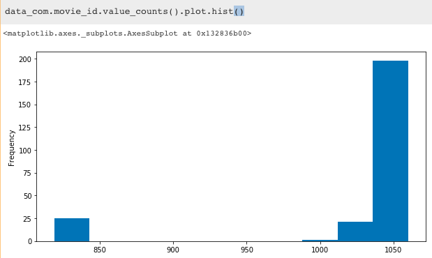

### movie_people

`movie_people*.json`爬取每个短评的点评人的特征信息。由于点评人的豆瓣页面上的用户信息并不充分，所以仅爬取了每个短评人的常居地、用户的个人简介、好友数和被关注的成员数。下面是一个实例，红色框中即是爬取的目标信息：


这里留下了一些遗憾，未能完整爬取每个点评人与电影短评相关的特征信息，如用户的豆瓣注册时间未能成功爬取下来。另外，每个豆瓣用户的电影短评（不仅仅是Top250电影）也应该是非常有用的特征信息，但是因时间精力有限为能爬取。

Scrapy中items详情可见`./douban_movie/douban_movie/items.py`，也可预览下图：

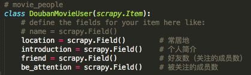


##  二、数据清理与特征工程+统计分析

收集到的json数据非常的raw，所以首先进行数据清理。若查看以下内容所对应的可执行文件，请移步[./data_cleaning&feature_engineering/Filting.ipynb](./data_cleaning&feature_engineering/Filting.ipynb)文件。

### movie_item

```python
import pandas as pd
import numpy as np
import json

# 载入电影数据
data_item = pd.read_json('../douban_movie/data/movie_item.json', lines=True)
print('电影数目：' ,data_item.shape[0])

data_item['movie_id'] = data_item['movie_id'].apply(lambda x: int(x[0][3:]))  
# [电影-1300267] -> int(1300267)
data_item['comment_num'] = data_item['comment_num'].apply(lambda x: int(x[2:-1]))  
# 全部 62309 条 -> int(62309)
data_item['question_num'] = data_item['question_num'].apply(lambda x: int(x[2:-1]))  
# 全部23个 -> int(23)
data_item['rating_num'] = data_item['rating_num'].apply(lambda x: float(x[0]))   
# [9.2] -> float(9.2)
data_item['rating_per_stars1'] = data_item['rating_per_stars1'].apply(lambda x: float(x[:-1]))   
# 0.1% -> float(0.1)
data_item['rating_per_stars2'] = data_item['rating_per_stars2'].apply(lambda x: float(x[:-1]))  
data_item['rating_per_stars3'] = data_item['rating_per_stars3'].apply(lambda x: float(x[:-1]))  
data_item['rating_per_stars4'] = data_item['rating_per_stars4'].apply(lambda x: float(x[:-1]))  
data_item['rating_per_stars5'] = data_item['rating_per_stars5'].apply(lambda x: float(x[:-1]))
data_item['release_date'] = data_item['release_date'].apply(lambda x: int(x[0][1:-1]))  
# [(1939)] -> int(1939)
data_item['vote_num'] = data_item['vote_num'].apply(lambda x: int(x[0]))   
# [272357] -> int(272357)
data_item['movie_title'] = data_item['movie_title'].apply(lambda x: (x[0]))

# [238分钟] -> 238
data_item.loc[15,'runtime'] = ['80分钟']
# 处理电影时长
pattern = '\d+'
import re
data_item['runtime'] = data_item['runtime'].apply(lambda x: (x[0]))
data_item['runtime'] = data_item['runtime'].str.findall(pattern,flags=re.IGNORECASE).apply(lambda x: int(x[0]))

#处理电影简介
def Intro(introduces):
    Intro_ = ''
    for intro in introduces:
        intro = intro.strip()
        Intro_ += intro
    return Intro_
data_item['intro'] = data_item.intro.apply(Intro)
```

经过上述清理后，此时的DataFrame信息是：

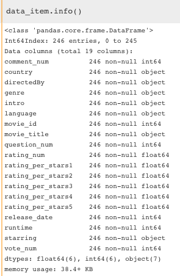

#### 1. 总评分最高的前10部电影

首先，我们就可以给出最高的前10部电影：

```python
data_item.sort_values('rating_num', ascending=False)[['movie_title','rating_num']].head(10)
```

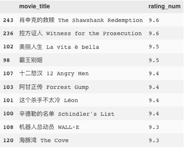

《肖申克的救赎》果然仍旧排在第一位，不过排在第二的《控方证人》确不在豆瓣Top250中排名靠前，看来豆瓣官方的排名是另有依据的。

接下来，将分别分析最受欢迎的电影类别`genre`、电影出品国家`country`、导演`directedBy`、演员`starring`、电影语言`language`、电影时长`runtime`和电影评价数`vote_num`。

首先，我们来定义三个函数以及电影类别和国别：

```python
class_movie = ['剧情','爱情','喜剧','科幻','动作','悬疑','犯罪','恐怖','青春'
               ,'励志','战争','文艺','黑色幽默','传记','情色','暴力','音乐','家庭']
country_movie = ['大陆','美国','香港','台湾','日本','韩国','英国','法国','德国'
                 ,'意大利','西班牙','印度','泰国','俄罗斯','伊朗','加拿大','澳大利亚'
                 ,'爱尔兰','瑞典','巴西','丹麦']

def column_expand(data, column, list_values):
    for cl in list_values:
        tt = data_item[column].apply(lambda x: str(x)).str.contains('\W'+cl+'\W')
        uu = data_item[column].apply(lambda x: str(x)).str.contains('^'+cl+'$')
        ee = data_item[column].apply(lambda x: str(x)).str.contains(cl+'\s')
        ff = data_item[column].apply(lambda x: str(x)).str.contains('\s'+cl)
        cl_ = tt | uu| ee | ff
        cl_ *= 1
        data['%s_%s' %(column ,cl)] = cl_

def get_values_list(data, column, sep=None):
    Language_values=[]
    def countLANG(Languages):
        for language in Languages:
            language = language.strip()
            if language in Language_values: 
                continue
            else:
                Language_values.append(language)
    if sep:
        pd.DataFrame(data[column].str.split(sep))[column].apply(countLANG);
    else:
        data[column].apply(countLANG);
    return Language_values

def Paiming(data, column, list_values):
    column_expand(data, column, list_values)
    df = pd.DataFrame( 
        {'数目':[data['%s_%s' %(column, p)].sum() for p in list_values]}
        , index=list_values).sort_values('数目', ascending=False)
    return df
# 列表匹配
#column_expand(data_item, 'genre', class_movie)
#column_expand(data_item,  'country', country_movie)
#column_expand(data_item,  'language', get_values_list(data_item, 'language', sep='/'))
#column_expand(data_item,  'starring', get_values_list(data_item, 'starring'))
```

上述代码中定义的`class_movie`和`country_movie`是搬运自豆瓣电影官方的电影分类，详情可点击这里：[XX](https://movie.douban.com/tag/#/)


#### 2. 最受欢迎的电影类别排名

```python
Paiming(data_item, 'genre', class_movie)
```

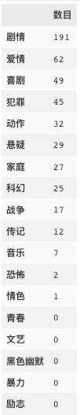

看一眼遥遥领先的第一名，原来大家都爱看剧情片啊！再瞅一眼最后一名，居然没有人爱看励志片？在我心目中，《肖申克的救赎》就是因励志才排名首位的哦～不禁感觉豆瓣电影有点不靠谱。。。。话说，还有一部情色电影上榜，它的名字是。。。。


#### 3. 最受欢迎的电影出品国家排名

```python
temp = Paiming(data_item, 'country', country_movie)
```

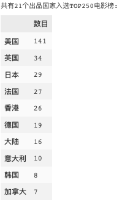

美国好莱坞大片果然高居榜首，遥遥领先，紧随其后的是英国、日本、法国。香港和大陆的片总共有42部上榜。放在世界地图上看看：

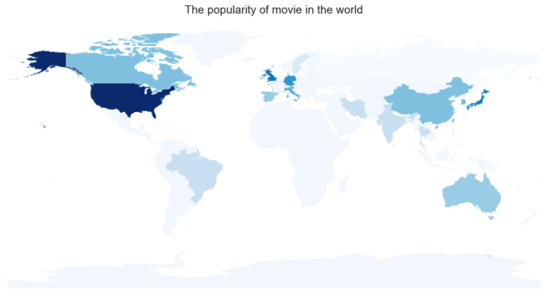

上图的代码：

```python
def geod_world(df, title, legend = False):
    """
    temp0 = temp.reset_index()
    df = pd.DataFrame({'NAME': temp0['index'].map(country_dict).tolist() 
                   ,'NUM': (np.log1p(temp0['数目'])*100).tolist()})
    """
    import geopandas as gp
    from matplotlib import pyplot as plt
    %matplotlib inline
    import matplotlib
    import seaborn as sns
    matplotlib.rc('figure', figsize = (14, 7))
    matplotlib.rc('font', size = 14)
    matplotlib.rc('axes', grid = False)
    matplotlib.rc('axes', facecolor = 'white')

    world_geod = gp.GeoDataFrame.from_file('./world_countries_shp/World_countries_shp.shp')
    data_geod = gp.GeoDataFrame(df)   # 转换格式
    da_merge = world_geod.merge(data_geod, on = 'NAME', how = 'left') # 合并
    sum(np.isnan(da_merge['NUM'])) # 
    da_merge['NUM'][np.isnan(da_merge['NUM'])] = 14.0#填充缺失数据
    da_merge.plot('NUM', k = 20, cmap = plt.cm.Blues,alpha= 1,legend = legend)
    plt.title(title, fontsize=15)#设置图形标题
    plt.gca().xaxis.set_major_locator(plt.NullLocator())#去掉x轴刻度
    plt.gca().yaxis.set_major_locator(plt.NullLocator())#去年y轴刻度
    
country_dict = {'大陆':'China','美国':'United States','香港':'Hong Kong'
                ,'台湾':'Taiwan, Province of China'
                 ,'日本':'Japan','韩国':'Korea, Republic of','英国':'United Kingdom'
                ,'法国':'France','德国':'Germany'
                 ,'意大利':'Italy','西班牙':'Spain','印度':'India','泰国':'Thailand'
                ,'俄罗斯':'Russian Federation'
                 ,'伊朗':'Iran','加拿大':'Canada','澳大利亚':'Australia'
                ,'爱尔兰':'Ireland','瑞典':'Sweden'
                 ,'巴西':'Brazil','丹麦':'Denmark'}

temp0 = temp.reset_index()
df = pd.DataFrame({'NAME': temp0['index'].map(country_dict).tolist() 
                   ,'NUM': (np.log1p(temp0['数目'])*100).tolist()})
geod_world(df, 'The popularity of movie in the world ')    
```


#### 4. 最受欢迎的电影导演排名

```python
Paiming(data_item, 'directedBy', get_values_list(data_item, 'directedBy'))
```

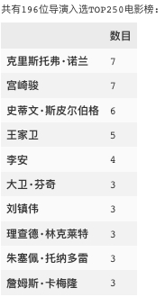

排前几名的都是耳熟能详的大导演，其中还有自豪的中国人代表王家卫和李安。


#### 5. 最受欢迎的电影演员排名

```python
Paiming(data_item, 'starring', get_values_list(data_item, 'starring'))
```

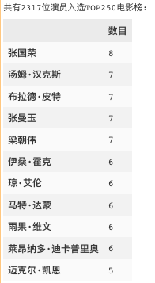

上榜的名人几乎都是耳熟能详的，但在好莱坞大片席卷全球的今天，出乎意料的是“张国荣”演技出色，居然直接排名第一！共有八部参演电影入榜，影帝“汤姆·汉克斯”也只能屈居后位。


#### 6. 最受欢迎的电影语言排名

```python
Paiming(data_item, 'language', get_values_list(data_item, 'language', sep='/'))
```

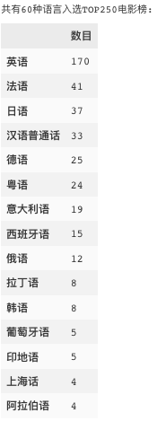

毫不意外地，英语是最受欢迎的电影语言。

#### 7. 根据电影时长的电影排名

```python
data_item.sort_values('runtime', ascending=False)[['movie_title','runtime']].head(10)
```

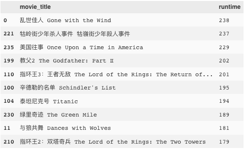

注：`runtime`为分钟数。

乱世佳人是超级经典片啊！排名第二的那个片是什么鬼。。。。

#### 8. 根据电影投票数的电影排名

```python
data_item.sort_values('vote_num', ascending=False)[['movie_title','vote_num']].head(10)
```

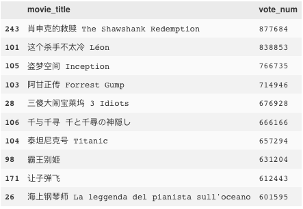

#### 9. 根据电影评价数的电影排名

```python
data_item.sort_values('comment_num', ascending=False)[['movie_title','comment_num']].head(10)
```

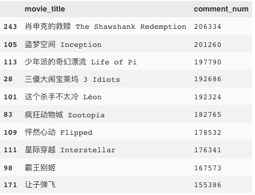

我们会发现电影评价数和电影的投票数是极强相关的，pearsonr系数达到了0.9：

```python
sns.jointplot(x="comment_num", y="vote_num", data=data_item)
```

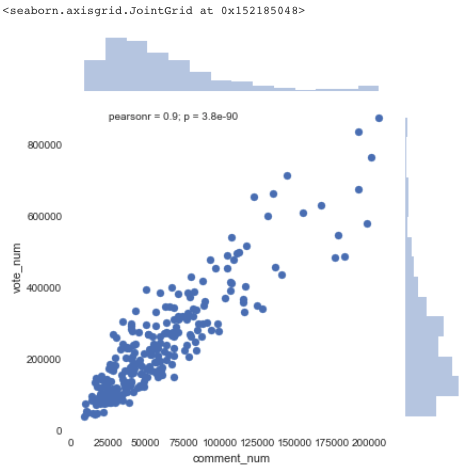

#### 10. 根据电影提问数的电影排名

```python
data_item.sort_values('question_num', ascending=False)[['movie_title','question_num']].head(10)
```

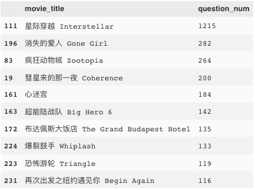

然而，电影提问数和上面的电影投票／评价数就没有多大的相关性了：

```python
sns.jointplot(x="question_num", y="vote_num", data=data_item)
```

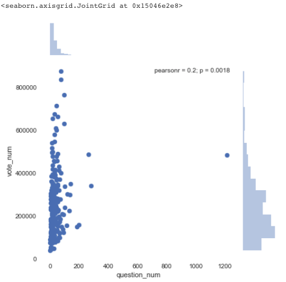


上述是分别针对data_item中的10个columns单独做统计排序分析。接下来对其他columns单独做相应的统计分析。

#### 11. 根据电影发布时间的规律

将所有Top电影按照发布时间排序后，我们可以对比观察到Top好电影大多集中在90年代之后。每部电影的投票数也与之基本正相关，主要对90年代以来的电影尤为青睐和关注。

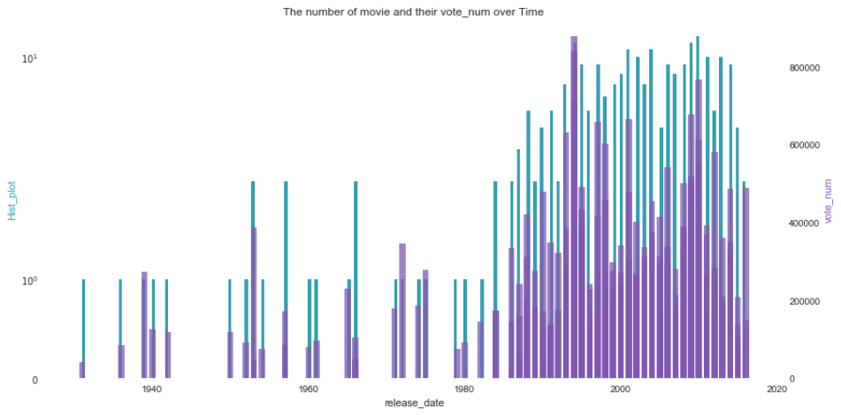

上图的代码：

```python
def plot2y(x_data, x_label, type1, y1_data, y1_color, y1_label, type2, y2_data, y2_color, y2_label, title):
    _, ax1 = plt.subplots()
    
    if type1 == 'hist':
        ax1.hist(x_data, histtype='stepfilled', bins=200, color = y1_color)
        ax1.set_ylabel(y1_label, color = y1_color) 
        ax1.set_xlabel(x_label)
        ax1.set_yscale('symlog')
        ax1.set_title(title)

    elif type1 == 'plot':
        ax1.plot(x_data, y1_data, color = y1_color)
        ax1.set_ylabel(y1_label, color = y1_color) 
        ax1.set_xlabel(x_label)
        ax1.set_yscale('linear')
        ax1.set_title(title)
        
    elif type1 == 'scatter':
        ax1.scatter(x_data, y1_data, color = y1_color, s = 10, alpha = 0.75)
        ax1.set_ylabel(y1_label, color = y1_color) 
        ax1.set_xlabel(x_label)
        ax1.set_yscale('symlog')
        ax1.set_title(title)
        
    if type2 == 'bar':
        ax2 = ax1.twinx()
        ax2.bar(x_data, y2_data, color = y2_color, alpha = 0.75)
        ax2.set_ylabel(y2_label, color = y2_color)
        ax2.set_yscale('linear')
        ax2.spines['right'].set_visible(True)
        
    elif type2 == 'scatter':
        ax2 = ax1.twinx()
        ax2.scatter(x_data, y2_data, color = y2_color, s = 10, alpha = 0.75)
        ax2.set_ylabel(y2_label, color = y2_color)
        ax2.set_yscale('linear')
        ax2.spines['right'].set_visible(True)
# 绘制双图函数plot2y：
plot2y(x_data = data_item.release_date
           , x_label = 'release_date'
           , type1 = 'hist'
           , y1_data = data_item.vote_num #(无效果)
           , y1_color = '#539caf'
           , y1_label = 'Hist_plot'
           , type2 = 'bar'
           , y2_data = data_item.vote_num
           , y2_color = '#7663b0'
           , y2_label = 'vote_num'
           , title = 'The number of movie and their vote_num over Time')
```

回想之前给出的电影时长排名，不禁疑惑，究竟是过去爱拍超长电影，还是现代更爱拍超长电影呢？上图来看看：

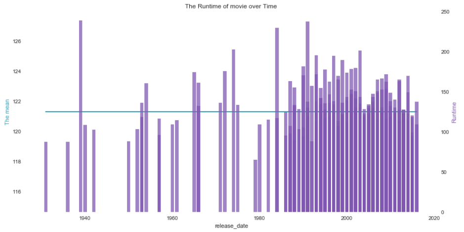

上图中的横线是Top电影时长的平均值，是2小时(121.3分钟)。可以看到，虽然历史上最长电影时长“乱世佳人”拍摄于40年代，但是现代电影从80年代开始就普遍开始更多的拍摄较长时长的电影了。

上图代码：

```python
plot2y(x_data = data_item.release_date
           , x_label = 'release_date'
           , type1 = 'plot'
           , y1_data = data_item.runtime.apply(lambda x : data_item.runtime.mean())
           , y1_color = '#539caf'
           , y1_label = 'The mean'
           , type2 = 'bar'
           , y2_data = data_item.runtime
           , y2_color = '#7663b0'
           , y2_label = 'Runtime'
           , title = 'The Runtime of movie over Time')
```


#### 12. 1～5星级投票的百分比

最后就只剩下给分星级所占比例的分析了，我们根据核密度估计绘制1-5星所占百分比的分布曲线。


毕竟是Top250的电影，很自然地5星比例是最高的，超过了50%，1星和2星的比例非常少，基本接近0%。

上图的代码：

```python
sns.kdeplot(data_item.rating_per_stars5, bw=2)
sns.kdeplot(data_item.rating_per_stars4, bw=2)
sns.kdeplot(data_item.rating_per_stars3, bw=2)
sns.kdeplot(data_item.rating_per_stars2, bw=2)
sns.kdeplot(data_item.rating_per_stars1, bw=2)
plt.yscale('log')
plt.title('Rating percent for stars 1-5')
```


#### 13. 电影简介的情感分析

对每个电影的电影简介，分词-去停用词-关键词抽取，可如下图预览：

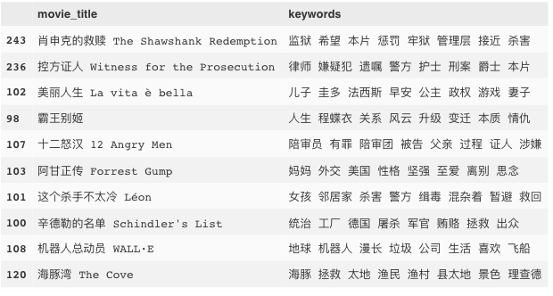

上图代码如下：

```python
import warnings
warnings.filterwarnings("ignore")
import jieba   # 分词包
import numpy as np
import codecs
import pandas as pd

def lcut(Intro_movie):
  	# 导入、分词、去停用词
    segment=[]
    segs = jieba.lcut(Intro_movie) # jiaba.lcut()   
    for seg in segs:
        if len(seg)>1 and seg!='\r\n':
            segment.append(seg)
    return segment

def dropstopword(segment):
    # 去停用词
    words_df = pd.DataFrame({'segment':segment})
    stopwords = pd.read_csv("../stopwords.txt" 
                      ,index_col=False
                      ,quoting=3
                      ,sep="\t"
                      ,names=['stopword']
                      ,encoding='utf-8') # quoting=3 全不引用    
    #stopwords.head()
    return words_df[~words_df.segment.isin(stopwords.stopword)].segment.values.tolist()
  
  
# 基于TextRank算法的关键词抽取(仅动词和动名词)
import jieba.analyse as analyse

data_item['keywords'] = data_item.intro.apply(lcut)\
                .apply(dropstopword)\
                .apply(lambda x : " ".join(x))\
                .apply(lambda x:" ".join(analyse.textrank(x, topK=8
                                                          , withWeight=False
                                                          , allowPOS=('n','ns'
                                                                      ,'vn', 'v'))))
data_item.sort_values('rating_num', ascending=False)[['movie_title','keywords']].head(10)
```


暂告一段落吧，其实还有很多可以分析的，比如导演最喜好拍的电影类型、导演最爱合作的电影演员，演员最喜好演的电影类型等等。。。时间有限～下回分解～


### movie_comment

还是老套路，我们需要读取短评数据，并且清理一下：

```python
import pandas as pd
import numpy as np
import json
# 短评数据
movie_comment_file = ['../douban_movie/data/movie_comment%s.json' %j for j in [ i for i in range(20,220,20)] +[225,250]]
com = []
for f in movie_comment_file:
    lines = open(f, 'rb').readlines()
    com.extend([json.loads(elem.decode("utf-8")) for elem in lines])
data_com = pd.DataFrame(com)
data_com['movie_id'] = data_com['movie_id'].apply(lambda x: int(x[0][5:]))
data_com['content'] = data_com.content.apply(lambda x: x[0].strip())
data_com['people'] = data_com.people.apply(lambda x: x.strip())
data_com['people'] = data_com.people_url.apply(lambda x: x[30:-1])
data_com['useful_num'] = data_com.useful_num.apply(lambda x: int(x))
def regular_nonstar(x):
    if x == 'comment-time':
        return 'allstar00 rating'
    else:
        return x
data_com['star'] = data_com.star.apply(regular_nonstar).apply(lambda x: int(x[7]))
data_com['time'] = pd.to_datetime(data_com.time.apply(lambda x: x[0]))
print('获取的总短评数：' ,data_com.shape[0])
```

上述简单的清理过后，还需要对短评做取重处理，因为爬虫下来的短评存在了重复现象：

```python
data_com = data_com[~data_com.comment_id.duplicated()]
print('去重后的总短评数：' ,data_com.shape[0])
# 去重后的总短评数： 249512

# 以下代码是将去重后的短评人URL保存给Scrapy进一步爬虫：
#people_url = data_com.people_url.unique().tolist()
#np.savetxt('../douban_movie/bin/people_url.out', people_url, fmt='%s')
#urllist = np.loadtxt('../douban_movie/bin/people_url.out', dtype='|S').tolist()
#len(urllist)  # 共38599个people
```

清理过后，我们获得了TOP250电影的总短评数249512个。瞅一眼每一列的数据类型之前，我们先drop掉用于爬虫时候检查爬取质量的URL信息，并且添加了`label`信息，标示出给出3星及其以上的为“喜欢”，其他为"不喜欢"：

```python
data_com = data_com.drop(['URL','people_url'], axis=1)
data_com['label'] = (data_com.star >=3) *1
data_com.info()
```

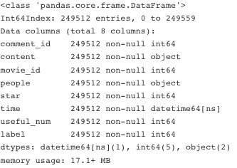

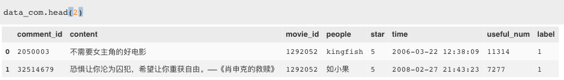

每个电影爬取的短评数量不太相同，最少有819个短评，如电影“贫民窟的百万富翁 Slumdog Millionaire”，最多有1060个短评，如电影“幸福终点站 The Terminal”。总体分布可见下图，横轴是每个电影的短评量，纵轴是相应的电影个数：


上图的代码：

```python
data_com.movie_id.value_counts().hist(bins=20)
plt.ylabel('Number of movie')
plt.xlabel('Number of short_comment of each movie')
```


接下来的分析，我们分成两大角度：某个电影下的短评和所有电影的短评。

#### 1. 就《肖申克的救赎》这个电影而言

首先，我们根据`movie_id`取出“肖申克的救赎”的所有电影短评：

```python
data_com_X = data_com[data_com.movie_id == 1292052]
print('爬取《肖申克的救赎》的短评数：', data_com_X.shape[0])
# 爬取《肖申克的救赎》的短评数： 1040
```

导入包文件：

```python
from __future__ import division, print_function
from matplotlib import pyplot as plt
%matplotlib inline
import matplotlib
import seaborn as sns
matplotlib.rc('figure', figsize = (14, 7))
matplotlib.rc('font', size = 14)
matplotlib.rc('axes', grid = False)
matplotlib.rc('axes', facecolor = 'white')
```

首先，在短评数据中，真正吃信息的只有短评时间、短评星级、短评的有用数和短评文本。

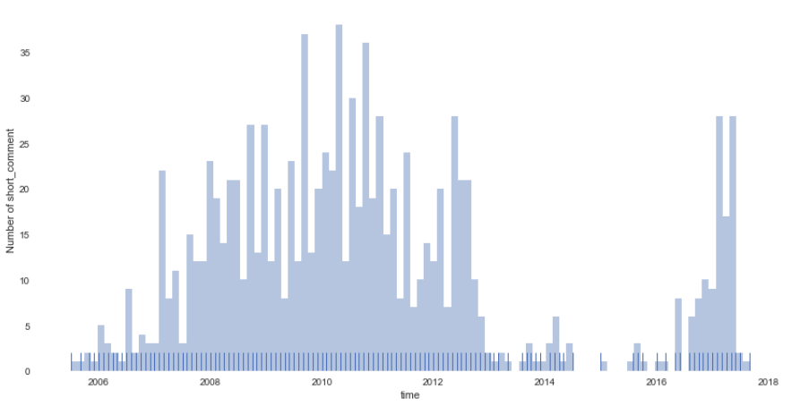

上图是所有的短评在时间尺度上的分布，可以看到2007-2013年的短评数量以及2017年最近的短评数尤为丰富，不得不怀疑，豆瓣电影在短评数据的筛选是别有用心的啊～～～上图代码：

```python
sns.distplot(data_com_X.time.apply(lambda x: int(x.year)+float(x.month/12.0))
             , bins=100, kde=False, rug=True)
plt.xlabel('time')
plt.ylabel('Number of short_comment')
```

接下来，我们查看下短评星级和短评的有用数，在时间尺度下如何分布的：

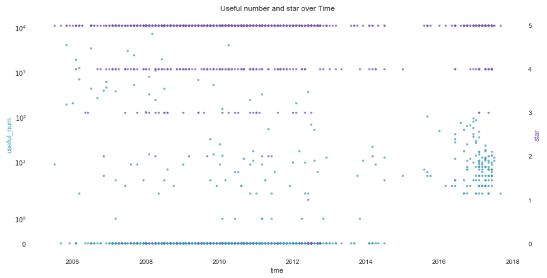

可以看到，绝大部分给的星级得分是5星，这很自然；其对应的分布在2006-2014年间，最高和最低有用数差距最大，而2017年最近的评价中，有用的短评数量比较聚集集中。上图的代码如下：

```python
plot2y(x_data = data_com_X.time.apply(lambda x: int(x.year)+float(x.month/12.0))
           , x_label = 'time'
           , type1 = 'scatter'
           , y1_data = data_com_X['useful_num']
           , y1_color = '#539caf'
           , y1_label = 'useful_num'
           , type2 = 'scatter'
           , y2_data = data_com_X['star']
           , y2_color = '#7663b0'
           , y2_label = 'star'
           , title = 'Useful number and star over Time')
```

综合这些信息看来，豆瓣电影在考虑选取短评的时候，首先对评论时间做了筛选，选取了10年以内的短评，尤其针对最近1年左右的短评，还要求其中有用数相当，不允许其中存在“无用”的短评，由此提升电影短评对观众选择电影的影响力。

##### 短评词云

接下来，我们根据短评文本生成该电影短评的词云：

```python
import warnings
warnings.filterwarnings("ignore")
import jieba   # 分词包
import numpy
import codecs
import pandas as pd
import matplotlib.pyplot as plt
%matplotlib inline
import matplotlib
matplotlib.rcParams['figure.figsize']=(10.0,5.0)
from wordcloud import WordCloud # 词云包

content_X = data_com_X.content.dropna().values.tolist()
# 导入、分词
segment=[]
for line in content_X: 
    try:
        segs = jieba.lcut(line) # jiaba.lcut()   
        for seg in segs:
            if len(seg)>1 and seg!='\r\n':
                segment.append(seg)
    except:
        print(line)
        continue
        
# 去停用词
words_df = pd.DataFrame({'segment':segment})
stopwords = pd.read_csv("../stopwords.txt" 
                      ,index_col=False
                      ,quoting=3
                      ,sep="\t"
                      ,names=['stopword']
                      ,encoding='utf-8') # quoting=3 全不引用    
#stopwords.head()
words_df=words_df[~words_df.segment.isin(stopwords.stopword)]

# 统计词频
words_stat = words_df.groupby(by=['segment'])['segment'].agg({"计数":np.size})
words_stat=words_stat.reset_index().sort_values(by=["计数"],ascending=False)
#words_stat.head()

# 词云
wordcloud = WordCloud(font_path="../simhei.ttf"
                      ,background_color="white"
                      ,max_font_size=80)
word_frequence={x[0]:x[1] for x in words_stat.head(1000).values}
wordcloud=wordcloud.fit_words(word_frequence)
plt.imshow(wordcloud)
```

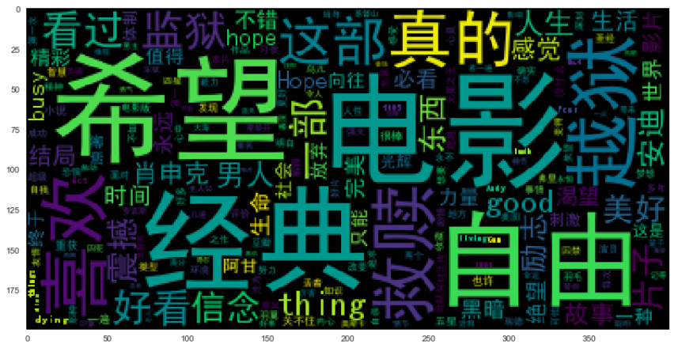

自定义背景图看下哈！


图片是我从电影海报抠下来的哈。上图代码如下：

```python
# 加入自定义图
from scipy.misc import imread
matplotlib.rcParams['figure.figsize']=(10.0,10.0)
from wordcloud import WordCloud,ImageColorGenerator
bimg=imread('cover.jpg')
wordcloud=WordCloud(background_color="white"
                    ,mask=bimg,font_path='../simhei.ttf'
                    ,max_font_size=200)
word_frequence={x[0]:x[1] for x in words_stat.head(1000).values}
wordcloud=wordcloud.fit_words(word_frequence)
bimgColors=ImageColorGenerator(bimg)
plt.axis("off")
plt.imshow(wordcloud.recolor(color_func=bimgColors))
```


接下来，我们根据短评文本和点评人是否喜欢作为训练数据，构建情感褒贬分析分类器：

##### 用朴素贝叶斯完成中文文本分类器

首先准备数据，我们会发现，训练数据样本的label非常的不平衡，正样本是负样本的20倍：

```python
data_com_X.label.value_counts()
# 1    993
# 0     47
# Name: label, dtype: int64
```

于是，我先采用下采样，复制负样本20遍使得正负样本平衡，并且drop停用词，最后生成训练集：

```python
import warnings
warnings.filterwarnings("ignore")
import jieba   # 分词包
import numpy
import codecs
import pandas as pd

def preprocess_text(content_lines,sentences,category):
    for line in content_lines:
        try:
            segs=jieba.lcut(line)
            segs = filter(lambda x:len(x)>1, segs)
            segs = filter(lambda x:x not in stopwords, segs)
            sentences.append((" ".join(segs), category))
        except:
            print(line)
            continue

data_com_X_1 = data_com_X[data_com_X.label == 1]
data_com_X_0 = data_com_X[data_com_X.label == 0]	    
            
# 下采样
sentences=[]
preprocess_text(data_com_X_1.content.dropna().values.tolist() ,sentences ,'like')
n=0
while n <20:
    preprocess_text(data_com_X_0.content.dropna().values.tolist() ,sentences ,'nlike')
    n +=1
    
# 生成训练集（乱序）
import random
random.shuffle(sentences)
"""
for sentence in sentences[:10]:
    print(sentence[0], sentence[1])
"""
# 明明 勇敢 心式 狗血 nlike
# 震撼 like
```

接下来就是通过交叉验证，在朴素贝叶斯分类器下构建模型，给出准确率：

```python
from sklearn.cross_validation import StratifiedKFold
from sklearn.naive_bayes import MultinomialNB
from sklearn.metrics import accuracy_score,precision_score
#from sklearn.model_selection import train_test_split
x,y=zip(*sentences)

def stratifiedkfold_cv(x,y,clf_class,shuffle=True,n_folds=5,**kwargs):
    stratifiedk_fold = StratifiedKFold(y, n_folds=n_folds, shuffle=shuffle)
    y_pred = y[:]
    for train_index, test_index in stratifiedk_fold:
        X_train, X_test = x[train_index], x[test_index]
        y_train = y[train_index]
        clf = clf_class(**kwargs)
        clf.fit(X_train,y_train)
        y_pred[test_index] = clf.predict(X_test)
    return y_pred

NB = MultinomialNB
print(precision_score(y
                      ,stratifiedkfold_cv(vec.transform(x)
                                          ,np.array(y),NB)
                      , average='macro'))
# 0.910392190906
```

虽然看似准确率还不错，但其实由于负样本太不丰富，且数据总量也小，所以测试短评时并不一定能给出理想的结果，如下面自定义的中文文本分类器例子：

```python
import re
from sklearn.feature_extraction.text import CountVectorizer
from sklearn.model_selection import train_test_split
from sklearn.naive_bayes import MultinomialNB

class TextClassifier():
    def __init__(self, classifier=MultinomialNB()):
        self.classifier = classifier
        self.vectorizer = CountVectorizer(analyzer='word'
                                          ,ngram_range=(1,4)
                                          ,max_features=20000)
    def features(self, X):
        return self.vectorizer.transform(X)
    
    def fit(self, X, y):
        self.vectorizer.fit(X)
        self.classifier.fit(self.features(X), y)
        
    def predict(self, x):
        return self.classifier.predict(self.features([x]))
    
    def score(self, X, y):
        return self.classifier.score(self.features(X), y)
```

```python
text_classifier=TextClassifier()
text_classifier.fit(x_train,y_train)
print(text_classifier.predict('一点 不觉得震撼'))
print(text_classifier.predict('好看'))
print(text_classifier.score(x_test,y_test))
# ['nlike']
# ['nlike']
# 0.913223140496
```


##### 用SVC完成中文文本分类器

与上面类似的，我们用SVC构建模型，看下效果会如何：

```python
import re
from sklearn.feature_extraction.text import TfidfVectorizer 
from sklearn.model_selection import train_test_split 
from sklearn.svm import SVC

class TextClassifier():
    def __init__(self, classifier=SVC(kernel='linear')):
        self.classifier = classifier
        self.vectorizer = TfidfVectorizer(analyzer='word'
                                          ,ngram_range=(1,4)
                                          ,max_features=20000)

    def features(self, X):
        return self.vectorizer.transform(X)
    
    def fit(self, X, y):
        self.vectorizer.fit(X)
        self.classifier.fit(self.features(X), y)
    
    def predict(self, x):
        return self.classifier.predict(self.features([x]))
    
    def score(self, X, y):
        return self.classifier.score(self.features(X), y)
```

```python
text_classifier=TextClassifier()
text_classifier.fit(x_train,y_train)
print(text_classifier.predict('一点 不觉得震撼'))
print(text_classifier.predict('好看'))
print(text_classifier.score(x_test,y_test))
# ['like']
# ['like']
# 0.971074380165
```

看来SVC也就是类似的效果。


##### 用Facebook FastText有监督完成中文文本分类

首先，我们需要生成FastText的文本格式：

```python
import jieba 
import pandas as pd 
import random

# 停用词
stopwords=pd.read_csv("../stopwords.txt",index_col=False,quoting=3
                      ,sep="\t",names=['stopword'], encoding='utf-8')
stopwords=stopwords['stopword'].values

def preprocess_text(content_lines,sentences,category): 
    for line in content_lines:
        try:
            segs=jieba.lcut(line)
            segs = filter(lambda x:len(x)>1, segs)
            segs = filter(lambda x:x not in stopwords, segs)
            sentences.append("__label__"+str(category)+" , "+" ".join(segs))
        except:
            print(line)
            continue
            
# 生成训练数据            
sentences=[]
preprocess_text(data_com_X_1.content.dropna().values.tolist() ,sentences ,'like')
n=0
while n <20:
    preprocess_text(data_com_X_0.content.dropna().values.tolist() ,sentences ,'nlike')
    n +=1
random.shuffle(sentences)

# 写入文件
print("writing data to fasttext supervised learning format...")
out = open('train_data_unsupervised_fasttext.txt','w' )#,encoding='utf-8') 
for sentence in sentences:
    out.write(sentence+"\n") 
print("done!")
```

启用fastTest模型：

```python
# 调用fastTest模型
import fasttext
# 有监督
classifier=fasttext.supervised('train_data_unsupervised_fasttext.txt'
                               , 'classifier.model' #        
                               , label_prefix='__label__')
# 对模型进行评估
result = classifier.test('train_data_unsupervised_fasttext.txt')
print('P@1:',result.precision)
print('R@1:',result.recall)
print('Number of examples:',result.nexamples)
# P@1: 0.9447208402432283
# R@1: 0.9447208402432283
# Number of examples: 1809
```

测试一下实际效果：

```python
texts = '真心 不好看'
labels=classifier.predict(texts)
print(labels[0][0])
labels=classifier.predict_proba(texts,k=2)
print(labels[0])
# like
# [('like', 0.871094), ('nlike', 0.126953)]
```

可以看到对于有监督的fastTest模型，依旧测试并不理想。

##### 用Facebook FastText无监督学习

下面我们试试无监督的fastTest模型会如何呢？下面继续照猫画虎：

```python
import jieba 
import pandas as pd 
import random

stopwords=pd.read_csv("../stopwords.txt",index_col=False,quoting=3
                      ,sep="\t",names=['stopword'], encoding='utf-8')
stopwords=stopwords['stopword'].values

def preprocess_text_unsupervised(content_lines,sentences,category): 
    for line in content_lines:
        try:
            segs=jieba.lcut(line)
            segs = filter(lambda x:len(x)>1, segs)
            segs = filter(lambda x:x not in stopwords, segs)
            sentences.append(" ".join(segs))
        except:
            print(line)
            continue

sentences=[]
preprocess_text_unsupervised(data_com_X_1.content.dropna().values.tolist() 
                             ,sentences ,'like')
n=0
while n <20:
    preprocess_text_unsupervised(data_com_X_0.content.dropna().values.tolist() 
                                 ,sentences ,'nlike')
    n +=1
random.shuffle(sentences)

print("writing data to fasttext unsupervised learning format...")
out=open('train_data_unsupervised_fasttext.txt','w') 
for sentence in sentences:
    out.write(sentence+"\n") 
print("done!")            
```

```python
import fasttext
# Skipgram model
model=fasttext.skipgram('train_data_unsupervised_fasttext.txt','model') 
print(model.words) # list of words in dictionary
# CBOW model
#model=fasttext.cbow('train_data_unsupervised_fasttext.txt','model') 
#print(model.words) # list of words in dictionary
```


如此我们算是得到了词向量了，`print(model['生活'])` 即可查看某次的词向量。

类似的无监督学习是用word2vec：

```python
from gensim.models.word2vec import Word2Vec
model = Word2Vec(sentences,size=200,window=5,min_count=5, workers=4)
model.save("gensim_word2vec.model")
#model.wv['hope']
#model.wv.most_similar('喜欢')
```


现在这么流行深度学习，我们就用深度学习来搞一下试试哈！


##### 用CNN做中文文本分类

首先，数据预处理：

```python
import jieba 
import pandas as pd 
import random

stopwords=pd.read_csv("../stopwords.txt",index_col=False,quoting=3
                      ,sep="\t",names=['stopword'], encoding='utf-8')
stopwords=stopwords['stopword'].values

def preprocess_text(content_lines,sentences,category): 
    for line in content_lines:
        try:
            segs=jieba.lcut(line)
            segs = filter(lambda x:len(x)>1, segs)
            segs = filter(lambda x:x not in stopwords, segs)
            sentences.append((" ".join(segs), category))
        except:
            print(line)
            continue

# 生成训练数据            
sentences=[]
preprocess_text(data_com_X_1.content.dropna().values.tolist() ,sentences ,'like')
n=0
while n <20:
    preprocess_text(data_com_X_0.content.dropna().values.tolist() ,sentences ,'nlike')
    n +=1
random.shuffle(sentences)     

from sklearn.model_selection import train_test_split
x,y=zip(*sentences)
train_data,test_data,train_target,test_target=train_test_split(x, y, random_state=1234)
```

下面的代码就是构建两层CNN神经网络了：

```python
"""
基于卷积神经网络的中文文本分类
"""
from __future__ import absolute_import
from __future__ import division
from __future__ import print_function

import argparse
import sys
import numpy as np
import pandas as pd
from sklearn import metrics
import tensorflow as tf

learn = tf.contrib.learn
FLAGS = None
# 文档最长长度
MAX_DOCUMENT_LENGTH = 100
# 最小词频数
MIN_WORD_FREQUENCE = 2
# 词嵌入的维度
EMBEDDING_SIZE = 20
# filter个数
N_FILTERS = 10 # 10个神经元
# 感知野大小
WINDOW_SIZE = 20
#filter的形状
FILTER_SHAPE1 = [WINDOW_SIZE, EMBEDDING_SIZE]
FILTER_SHAPE2 = [WINDOW_SIZE, N_FILTERS] 
# 池化
POOLING_WINDOW = 4
POOLING_STRIDE = 2
n_words = 0

def cnn_model(features, target):
    """
    2层的卷积神经网络，用于短文本分类
    """
    # 先把词转成词嵌入
    # 我们得到一个形状为[n_words, EMBEDDING_SIZE]的词表映射矩阵
    # 接着我们可以把一批文本映射成[batch_size, sequence_length,EMBEDDING_SIZE]的矩阵形式
    target = tf.one_hot(target, 15, 1, 0) #对词编码
    word_vectors = tf.contrib.layers.embed_sequence(features
                                                    ,vocab_size=n_words
                                                    ,embed_dim=EMBEDDING_SIZE
                                                    ,scope='words')
    word_vectors = tf.expand_dims(word_vectors, 3)
    with tf.variable_scope('CNN_Layer1'):
        # 添加卷积层做滤波
        conv1 = tf.contrib.layers.convolution2d(word_vectors
                                                ,N_FILTERS
                                                ,FILTER_SHAPE1
                                                ,padding='VALID')
        # 添加RELU非线性
        conv1 = tf.nn.relu(conv1) 
        # 最大池化
        pool1 = tf.nn.max_pool(conv1
                               ,ksize=[1, POOLING_WINDOW, 1, 1]
                               ,strides=[1, POOLING_STRIDE, 1, 1]
                               ,padding='SAME')
        # 对矩阵进行转置，以满足形状
        pool1 = tf.transpose(pool1, [0, 1, 3, 2])
    with tf.variable_scope('CNN_Layer2'):
        # 第2卷积层
        conv2 = tf.contrib.layers.convolution2d(pool1
                                                ,N_FILTERS
                                                ,FILTER_SHAPE2
                                                ,padding='VALID') 
        # 抽取特征
        pool2 = tf.squeeze(tf.reduce_max(conv2, 1), squeeze_dims=[1])
        
    # 全连接层
    logits = tf.contrib.layers.fully_connected(pool2, 15, activation_fn=None)
    loss = tf.losses.softmax_cross_entropy(target, logits) 
    # 优化器
    train_op = tf.contrib.layers.optimize_loss(loss
                                               ,tf.contrib.framework.get_global_step()
                                               ,optimizer='Adam'
                                               ,learning_rate=0.01)
    
    return ({
            'class': tf.argmax(logits, 1),
            'prob': tf.nn.softmax(logits)
    }, loss, train_op)
```


对词汇处理：

```python
global n_words
# 处理词汇
vocab_processor = learn.preprocessing.VocabularyProcessor(MAX_DOCUMENT_LENGTH,min_frequency=MIN_WORD_FREQUENCE) 
x_train = np.array(list(vocab_processor.fit_transform(train_data)))
x_test = np.array(list(vocab_processor.transform(test_data)))
n_words=len(vocab_processor.vocabulary_) 
print('Total words:%d'%n_words)

cate_dic={'like':1,'nlike':0}
y_train = pd.Series(train_target).apply(lambda x:cate_dic[x] , train_target)
y_test = pd.Series(test_target).apply(lambda x:cate_dic[x] , test_target)
# Total words:370
```

接下来，就是模型的训练啦！

```python
# 构建模型
classifier=learn.SKCompat(learn.Estimator(model_fn=cnn_model))

# 训练和预测
classifier.fit(x_train,y_train,steps=1000) 
y_predicted=classifier.predict(x_test)['class'] 
score=metrics.accuracy_score(y_test,y_predicted) 
print('Accuracy:{0:f}'.format(score))
```

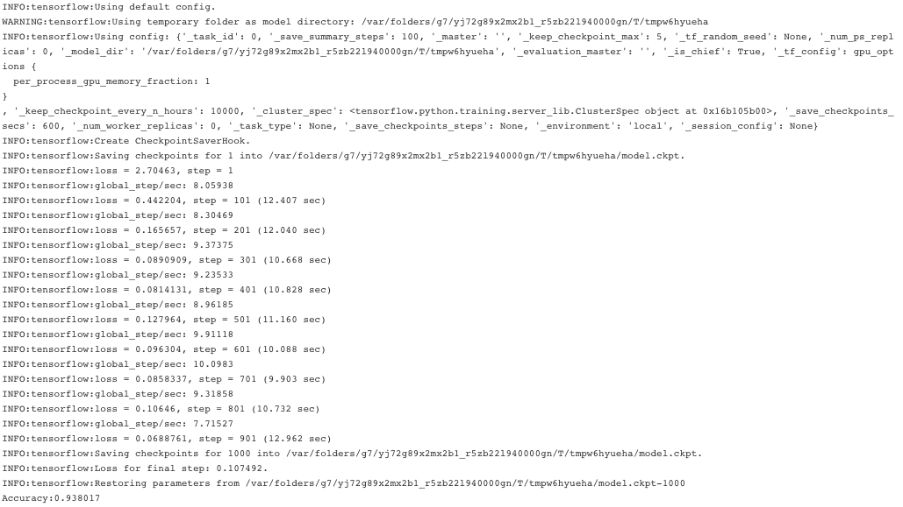


##### 用RNN做中文文本分类

```python
"""
使用RNN完成文本分类
"""

from __future__ import absolute_import
from __future__ import division
from __future__ import print_function

import argparse
import sys

import numpy as np
import pandas as pd
from sklearn import metrics
import tensorflow as tf
from tensorflow.contrib.layers.python.layers import encoders

learn = tf.contrib.learn

FALGS = None
```

```python
MAX_DOCUMENT_LENGTH=15
MIN_WORD_FREQUENCE=1
EMBEDDING_SIZE=50
global n_words

# 处理词汇
vocab_processor = learn.preprocessing.VocabularyProcessor(MAX_DOCUMENT_LENGTH
                                                          ,min_frequency=MIN_WORD_FREQUENCE)
x_train = np.array(list(vocab_processor.fit_transform(train_data)))
x_test = np.array(list(vocab_processor.transform(test_data))) 
n_words = len(vocab_processor.vocabulary_)
print('Total words: %d' % n_words)

def bag_of_words_model(features, target): 
    """
    先转成词袋模型
    """
    target = tf.one_hot(target, 15, 1, 0)
    features = encoders.bow_encoder(features
                                    ,vocab_size=n_words
                                    ,embed_dim=EMBEDDING_SIZE)
    logits = tf.contrib.layers.fully_connected(features, 15
                                               ,activation_fn=None)
    loss = tf.contrib.losses.softmax_cross_entropy(logits, target)
    train_op = tf.contrib.layers.optimize_loss(loss
                                               ,tf.contrib.framework.get_global_step()
                                               ,optimizer='Adam'
                                               ,learning_rate=0.01)
    return ({
            'class': tf.argmax(logits, 1),
            'prob': tf.nn.softmax(logits)
    }, loss, train_op)

model_fn = bag_of_words_model
classifier = learn.SKCompat(learn.Estimator(model_fn=model_fn))

# Train and predict
classifier.fit(x_train, y_train, steps=1000)
y_predicted = classifier.predict(x_test)['class']
score = metrics.accuracy_score(y_test, y_predicted)
print('Accuracy: {0:f}'.format(score))
# Accuracy: 0.925620
```


##### 用GRU来完成中文文本分类

```python
def rnn_model(features,target): 
    """
    用RNN模型（这里用的是GRU）完成文本分类
    """
    # Convert indexes of words into embeddings.
    # This creates embeddings matrix of [n_words, EMBEDDING_SIZE] and then
    # maps word indexes of the sequence into [batch_size,sequence_length,
    # EMBEDDING_SIZE].
    word_vectors = tf.contrib.layers.embed_sequence(features
                                                    ,vocab_size=n_words
                                                    ,embed_dim=EMBEDDING_SIZE
                                                    ,scope='words')
    # Split into list of embedding per word, while removing doc length dim。
    # word_list results to be a list of tensors [batch_size,EMBEDDING_SIZE].
    word_list = tf.unstack(word_vectors, axis=1)
    
    # Create a Gated Recurrent Unit cell with hidden size of EMBEDDING_SIZE.
    cell = tf.contrib.rnn.GRUCell(EMBEDDING_SIZE)
    
    # Create an unrolled Recurrent Neural Networks to length of
    # MAX_DOCUMENT_LENGTH and passes word_list as inputs for each unit.
    _, encoding = tf.contrib.rnn.static_rnn(cell, word_list, dtype=tf.float32)
    
    # Given encoding of RNN, take encoding of last step (e.g hidden size of the
    # neural network of last step) and pass it as features for logistic
    # regression over output classes.
    target = tf.one_hot(target, 15, 1, 0)
    logits = tf.contrib.layers.fully_connected(encoding, 15, activation_fn=None)
    loss = tf.contrib.losses.softmax_cross_entropy(logits, target)
    
    # Create a training op.
    train_op = tf.contrib.layers.optimize_loss(
            loss,
            tf.contrib.framework.get_global_step(),
            optimizer='Adam',
            learning_rate=0.01)
    
    return ({
            'class': tf.argmax(logits, 1),
            'prob': tf.nn.softmax(logits)
    }, loss, train_op)


model_fn = rnn_model 
classifier=learn.SKCompat(learn.Estimator(model_fn=model_fn))

#Train and predict
classifier.fit(x_train,y_train,steps=1000) 
y_predicted=classifier.predict(x_test)['class']
score=metrics.accuracy_score(y_test,y_predicted)
print('Accuracy:{0:f}'.format(score))
# Accuracy:0.944215
```

同样地，也可以自定义一个预测函数：

```python
def pred(commment):
    sentences=[]
    preprocess_text([commment] ,sentences, 'unknown')
    x,y=zip(*sentences)
    x_tt = np.array(list(vocab_processor.transform([x[0]])))
    
    if classifier.predict(x_tt)['class'][0]:
        print('like')
    else:
        print('nlike')
pred('好精彩的电影！')
# like
```


小结一下，仅通过短评文本来分类点评人对电影的喜好确实浅薄了些，因为太多的短评内容与打分之间的关联事很弱的，有着很大的随意性：“我反正给不了5星”->4星->like、“还是经典，有机会以后要看高清的”->0星->nlike。。。。更何况，我们的训练数据label有着较为严重的样本不平衡的问题。所以，如果真的想较为全面且准确的预测点评人短评的喜好程度的话，就不仅需要更多且平衡label的训练数据，还需要考虑更多维度的信息，如横向对比电影简介、点评人简介以及点评人曾短评过的电影等信息，来判断全方面的判断点评人的喜好。


#### 2. 全部影片的短评数据分析

首先，我们照猫画虎的看一下对于全部短评数据而言，上述分析的结果是怎样的？

```python
#data_com.drop(['URL','people_url'],axis=1,inplace=True)
data_com
```

面对数据总量有249512个短评，运算速度有些慢哦～ 运行需谨慎～

下面只贴结果了～ 代码基本相同，只需要将变量`data_com_X`换成`data_com`即可。

（此处略过～ 数据量大，运算时间过长～ 等不起了啊）


### movie_people


首先，读入数据，并数据清理，短评人的条目数共有26321个：

```python
# 短评人数据
movie_people_file = ['../douban_movie/data/movie_people%s.json' %j for j in [ i for i in range(5000,45000,5000)] ]
peo = []
for f in movie_people_file:
    lines = open(f, 'rb').readlines()
    peo.extend([json.loads(elem.decode("utf-8")) for elem in lines])
data_peo = pd.DataFrame(peo)
data_peo.shape
# 去掉空值
data_peo = data_peo[~data_peo.friend.apply(lambda x: not (x[:])) \
         & ~data_peo.be_attention.apply(lambda x: not (x[:])) \
        & ~data_peo.location.apply(lambda x: not (x[:])) \
        &  ~data_peo.introduction.apply(lambda x: not (x[:])) ]

data_peo['friend'] = data_peo.friend.apply(lambda x: int(str(x)[4:-2]) )
data_peo['be_attention'] = data_peo.be_attention.apply(lambda x: int(re.findall(r"被(\d+)人", str(x))[0]) )
data_peo['location'] = data_peo.location.apply(lambda x: x[0])
data_peo.head()
print(data_peo.shape)
# (26321, 4)
```


我们有个很重要而又繁琐的任务就是，“标准化”每个短评人的常居地信息。因为，只有与自己提前准备好的shp地理信息名完全一致，才能用geopandas绘制在地图上。所以，我们制作了两个比较大的地理dict来对数据中的location做一个转换。

我们区分两大类，一类是国内省份+oversea，另一类是国外国家+China。其中，国内省份的转换中，发现常居地存在非省级单位的名字，转换起来也算颇费周折；国别名称的转换中更是麻烦多多，有些人的常居地仅写的是某国的地级单位，还有不少写的是某某没听说过的小岛国名字，还有关于南斯拉夫、塞尔维亚等10年内新建国家更是找不到对应，所以只能在地理上就近处理了；此外，还有人将英文拼写拼错的情况。。。。函数代码如下：

```python
def locaP(x):
    prov_dic = {'黑龙江':'黑龙江省', '内蒙': '内蒙古自治区', '新疆': '新疆维吾尔自治区'
            ,'吉林': '吉林省', '辽宁': '辽宁省', '甘肃': '甘肃省', '河北': '河北省'
            ,'北京': '北京市', '山西': '山西省', '天津': '天津市', '陕西': '陕西省'
            ,'宁夏': '宁夏回族自治区', '青海': '青海省', '山东': '山东省'
                , '西藏':  '西藏自治区'
            ,'河南': '河南省', '江苏': '江苏省', '安徽': '安徽省', '四川': '四川省'
            ,'湖北': '湖北省', '重庆': '重庆市', '上海': '上海市', '浙江': '浙江省'
            ,'湖南': '湖南省', '江西': '江西省', '云南': '云南省', '贵州': '贵州省'
            ,'福建': '福建省', '广西': '广西壮族自治区', '台湾': '台湾省', '广东':  '广东省'
            ,'香港': '香港特别行政区','澳门': '香港特别行政区', '海南': '海南省'
               , '苏州':'江苏省','威海':'山东省','嘉兴':'浙江省','锡林浩特':'内蒙古自治区'
               , '温州':'浙江省','肇庆': '广东省','红河':'云南省','延边':'吉林省'
               , '衢州':'浙江省','伊宁': '新疆维吾尔自治区','遵义':'贵州省','绍兴':'浙江省'
               , '库尔勒':'新疆维吾尔自治区','杭州':'浙江省','通化':'吉林省'}

    for d in prov_dic:
        if d in x:  return prov_dic[d]

def locaC(x):        
    country_dict = {'China':'China','United States':'United States'
                    ,'Hong Kong':'Hong Kong','Taiwan':'Taiwan, Province of China'
                 ,'Japan':'Japan','Korea':'Korea, Republic of'
                    ,'United Kingdom':'United Kingdom','France':'France'
                    ,'Germany':'Germany'
                 ,'Italy':'Italy','Spain':'Spain','India':'India'
                    ,'Thailand':'Thailand','Russia':'Russian Federation'
                 ,'Iran':'Iran','Canada':'Canada','Australia':'Australia'
                    ,'Ireland':'Ireland','Sweden':'Sweden'
                 ,'Brazil':'Brazil','Denmark':'Denmark'
                    ,'Singapore':'Singapore','Cuba':'Cuba','Iceland':'Iceland'
                    ,'Netherlands':'Netherlands', 'Switzerland':'Switzerland'
                    ,'Bahamas':'Bahamas','Sierra Leone':'Sierra Leone'
                    ,'Finland':'Finland','Czech Republic':'Czech Republic'
                    ,'Egypt':'Egypt','Turkey':'Turkey','Argentina':'Argentina'
                   ,'Bolivia':'Bolivia'
                    ,'Norway':'Norway','Indonesia':'Indonesia'
                    ,'Chile':'Chile','Morocco':'Morocco','Andorra':'Andorra'
                   ,'Senegal':'Senegal'
                    ,'Somalia':'Somalia','Haiti':'Haiti','Portugal':'Portugal'
                    ,'Togo':'Togo','New Zealand':'New Zealand'
                   ,'Hungary':'Hungary','Bulgaria':'Bulgaria'
                    ,'Afghanistan':'Afghanistan','Niue':'Niue','Austria':'Austria'
                   ,'Peru':'Peru','Greece':'Greece','Luxembourg':'Luxembourg'
                    ,'Greenland':'Greenland','Fiji':'Fiji','Jordan':'Jordan'
                   ,'Reunion':'Reunion','Bhutan':'Bhutan','Barbados':'Barbados'
                    ,'Malaysia':'Malaysia','Ghana':'Ghana'
                   ,'Poland':'Poland','Guinea':'Guinea','Belgium':'Belgium'
                    ,'Zimbabwe':'Zimbabwe','Aruba':'Aruba','Anguilla':'Anguilla'
                   ,'Nepal':'Nepal','Latvia':'Latvia'
                    ,'Philippines':'Philippines'
                    ,'United Arab Emirates':'United Arab Emirates'
                   ,'Saudi Arabia':'Saudi Arabia'
                    ,'South Africa':'South Africa','Mexico':'Mexico'
                    ,'Syrian':'Syrian Arab Republic'
                   ,'Sudan':'Sudan','Iraq':'Iraq','Slovenia':'Slovenia'
                    ,'Tunisia':'Tunisia','Nicaragua':'Nicaragua'
                    ,'Kazakhstan':'Kazakhstan'
                   ,'Bahrain':'Bahrain','Vietnam':'Viet Nam'
                    ,'Tuvalu':'Tuvula','Vatican City':'Vatican City State (Holy See)'
                   ,'Wallis et Futuna':'Wallis and Futuna Islands'
                    ,'Tanzania':'Tanzania, United Republic of'
                   ,'Libya':'Liby An Arab Jamahiriya'
                    ,'Western Sahara':'Western Sahara'
                    ,'Syria':'Syrian Arab Republic'
                   ,'Faroe Islands':'Faroe Islands'
                    ,'Sao Tome and Principe':'Sao Tome and Principe'
                   ,'Christmas Islands':'Christmas Islands'
                    ,'Costa Rica':'Costa Rica','Antarctica':'Antartica'
                   ,'Cook Islands':'Cook Islands','Kuwait':'Kuwait','Bermuda':'Bermuda'
                    ,'El Salvador':'El Salvador'
                   ,'Ethiopia':'Ethiopia','Mozambique':'Mozambique'
                    ,'Guyana':'Guyana','Mongolia':'Mongolia'
                    ,'Eritrea':'Eritrea'
                   ,'Monaco':'Monaco','Gibraltar':'Gibralter'
                    ,'Yemen':'Yemen','Micronesia':'Micronesia, (Federated States of)'
                   ,'Colombia':'Columbia','Guadeloupe':'Guadeloupe'
                    ,'Antigua':'Antigua & Barbuda','Caledonia':'New Caledonia'
                   ,'Cambodia':'Cambodia'
                    ,'Franch Guiana':'French Guiana','Vanuatu':'Vanuatu'
                    ,'Puerto Rico':'Puerto Rico'
                   ,'Belize':'Belize','Angola':'Angola','Dominica':'Dominica'
                    ,'Albania':'Albania','Azerbaijan':'Azerbaijan'
                   ,'Ukraine':'Ukraine','Grenada':'Grenada'
                    ,'Panama':'Panama','Israel':'Israel','Guatemala':'Guatemala'
                   ,'Belarus':'Belarus','Cameroon':'Cameroon'
                    ,'Jamaica':'Jamaica','Warwickshire':'United Kingdom'
                   ,'Madagascar':'Madagascar','Mali':'Mali'
                    ,'Tokelau':'Tokelau','Benin':'Benin','Malta':'Malta'
                   ,'Gabon':'Gabon','Algeria':'Algeria'
                    ,'Kildare':'Ireland','Ecuador':'Ecuador','Pakistan':'Pakistan'
                   ,'Chad':'Chad','Paraguay':'Paraguay','Leicestershire':'Ireland'
                    ,'Estonia':'Estonia','Maldives':'Maldives'
                   ,'Liechtenstein':'Liechtenstein','Cyprus':'Cyprus'
                    ,'Zambia':'Zambia'
                    ,'Macedonia':'Macedonia, The Former Republic of Yugoslavia'
                   ,'Bouvet':'Bouvet Island','Uganda':'Uganda'
                    ,'Northern Marianas':'Northern Mariana Islands'
                   ,'Miquelon':'St. Pierre and Miquelon','Pitcairn':'Pitcairn'
                    ,'Slovakia':'Slovakia','Norfolk':'Norfolk Island'
                   ,'Lanka':'Sri Lanka','Congo':'Congo'
                    ,'Cocos':'Cocos (Keeling) Islands','Serbia':'Bulgaria'
                    ,'Croatia':'Croatia'
                   ,'Palestinian':'Israel','Armenia':'Armenia'
                    ,'Saint Barthélemy':'France','Sint Maarten':'France'
                   ,'Côte':"Cote D'ivoire (Ivory Coast)"
                    ,'Jersey':'United Kingdom','Isle of Man':'United Kingdom'
                   ,'Aland Islands':'Finland','Kosovo':'Yugoslavia'
                    ,'Montenegro':'Yugoslavia'}
    for d in country_dict:
        if d in x:  return country_dict[d]    
        
```

于是，利用上面定义的函数，我们就可以对location字段作处理了，分别存为province和country两个字端：

```python
data_peo['province'] = data_peo.location.apply(locaP)
data_peo.province.fillna('oversea', inplace = True)
data_peo['country'] = data_peo.location.apply(lambda x : x.split(sep = ',')[-1].strip())\
					.apply(locaC)
data_peo.country.fillna('China', inplace = True)
data_peo.tail()
```

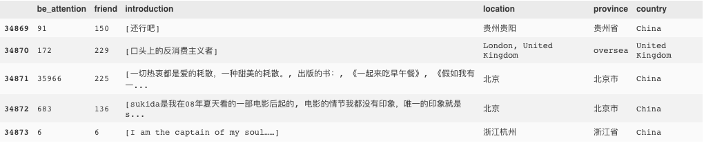

#### 1. 短评人常居地按照国家分布

首先，我们看下，短评都是来自哪些国家呢？

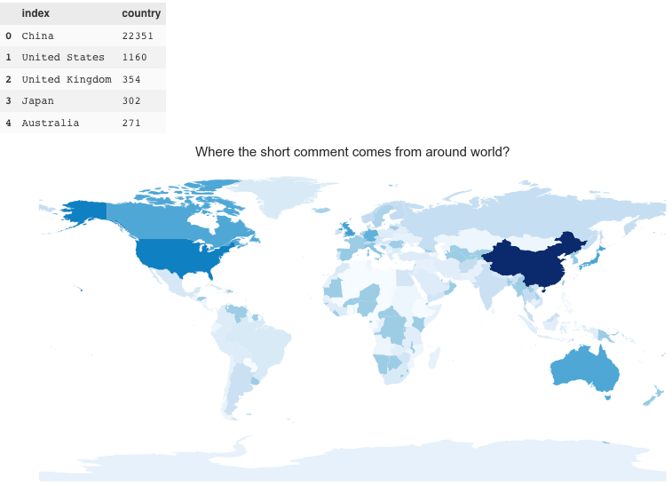

中国自然地是短评人主要常居地，其次分别是美国、英国、日本和澳大利亚。上述图片的代码如下：

```python
temp0 = data_peo.country.value_counts().reset_index()
df = pd.DataFrame({'NAME': temp0['index'].tolist()                    
                   ,'NUM': (np.log1p(temp0['country'])+10).tolist()}
                 )
geod_world(df, 'Where the short comment comes from around world? ', )
temp0.head()
```

#### 2. 中国短评人常居地按照省份分布

那么在中国范围内，哪些省份的短评人更活跃呢？

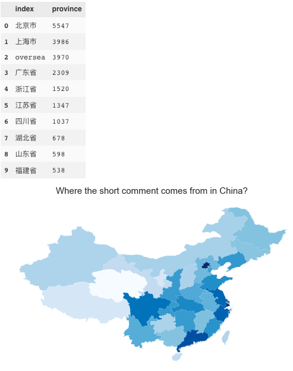

显然，排在榜首的北上广，紧随其后的是浙江、江苏和四川。这些省份的人更加活跃于豆瓣电影短评的热潮中。上述图片的代码如下所示：

```python
def geod_china(df, title, legend = False):
    """
    temp0 = temp.reset_index()
    df = pd.DataFrame({'NAME': temp0['index'].map(country_dict).tolist() 
                   ,'NUM': (np.log1p(temp0['数目'])*100).tolist()})
    """
    import geopandas as gp
    from matplotlib import pyplot as plt
    %matplotlib inline
    import matplotlib
    import seaborn as sns
    matplotlib.rc('figure', figsize = (14, 7))
    matplotlib.rc('font', size = 14)
    matplotlib.rc('axes', grid = False)
    matplotlib.rc('axes', facecolor = 'white')

    china_geod = gp.GeoDataFrame.from_file('./china_shp/中国地图shp格式/shp格式2/map/bou2_4p.shp',encoding = 'gb18030')
    data_geod = gp.GeoDataFrame(df)   # 转换格式
    da_merge = china_geod.merge(data_geod, on = 'NAME', how = 'left') # 合并
    sum(np.isnan(da_merge['NUM']))#
    da_merge['NUM'][np.isnan(da_merge['NUM'])] = 14.0#填充缺失数据
    da_merge.plot('NUM', k = 20, cmap = plt.cm.Blues,alpha= 1, legend = legend)
    plt.title(title, fontsize=15)#设置图形标题
    plt.gca().xaxis.set_major_locator(plt.NullLocator())#去掉x轴刻度
    plt.gca().yaxis.set_major_locator(plt.NullLocator())#去年y轴刻度
    
temp0 = data_peo.province.value_counts().reset_index()
df = pd.DataFrame({'NAME': temp0['index'].tolist()                    
                   ,'NUM': (np.log1p(temp0['province'])).tolist()}
                 )
geod_china(df, 'Where the short comment comes from in China? ', legend = False)
temp0.head(10)    
```

#### 3. 每个短评人的被关注数与好友数

关于所有短评人的被关注数和好友数，我们可以先结合起来看：

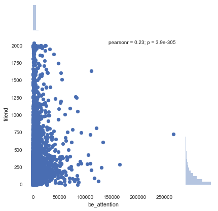

我们得到了一个意外的结果，一个短评人的被关注数和好友数居然没什么关系！？通常，我们都会理解一个人在网络上受欢迎的程度就是被关注数和好友数都很多，然而，人们在网络社交行为中，居然会有某种倾向：要么喜欢关注别人，要么就热衷于被关注。。。。 上图代码如下：

```python
sns.jointplot(x="be_attention", y="friend", data=data_peo)
```

#### 4. 中国短评人的被关注数和好友数的人均地域分布

那么，将被关注数和好友数分别人均地放在地域上来看，又会得到什么结果呢？还是北上广的人得到关注和好友数更多么？结果是让人出乎意料的：

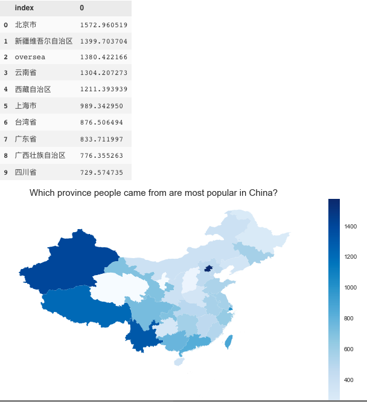

上图是各省份人均被关注数的分布情况，常居北京的最容易收到最多的关注，而紧随其后的常居地都是典型的旅游型省份：新疆、国外、云南、西藏。一方面来看，前段时间刚从新疆旅行回来，那边的生活水平还是不错的，网络社交活动比较活跃也可以理解；另一方面，我猜测是一些点评人为了社交的便利或给自己增添一些异域风情，而胡乱写的常居地，以此增加自己的被关注数。。。。。上图代码如下所示：

```python
temp0 = (data_peo.groupby(by='province').sum().be_attention / data_peo.province.value_counts()).sort_values(ascending=False).reset_index()

df = pd.DataFrame({'NAME': temp0['index'].tolist()                    
                   ,'NUM': temp0.ix[:,1].tolist()}
                 )
geod_china(df, 'Which province people came from are most popular in China? '
           , legend = True)
temp0.head(10)
```

与之对应的，我们来看看点评人的好友数是如何地域分布的：

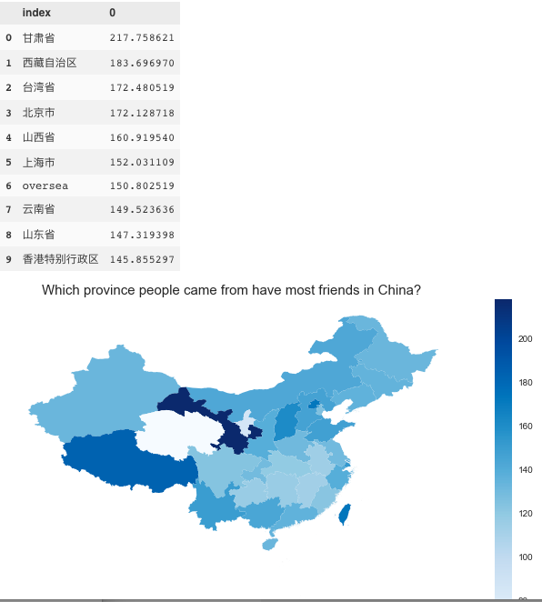

可以看到人均好友最多的省份是甘肃，紧跟着的是西藏、台湾、北京、山西和上海。甘肃我去过好些次，相对比较闭塞且经济发展容易受到不重视，其甘肃人民有较大的对外社交需求也可以理解。

#### 5. 根据点评人个人简介构建中文文本分类模型

接下来，我们就可以讨论讨论每个点评人的个人简介了。

我们把每个点评人的个人简介文本作为训练数据，地域信息作为label，构建模型。如此一来，就可以得到分类器，用以预测什么样的个人简介来自哪个省份。为了简化问题，我们这里仅取北京和上海两地的点评人常居地信息构建CNN模型：

```python
# label数据处理
def fixIntro(x):
    n = ''
    for i in x:
        n += i.strip()
        n +=' '
    return n
data_peo['introduction'] = data_peo.introduction.apply(fixIntro)
data_peo_b = data_peo[data_peo.province == '北京市']
data_peo_s = data_peo[data_peo.province == '上海市']
#data_peo_o = data_peo[data_peo.province == 'oversea']
```

```python
# 切词
import jieba 
import pandas as pd 
import random

stopwords=pd.read_csv("../stopwords.txt",index_col=False,quoting=3
                      ,sep="\t",names=['stopword'], encoding='utf-8')
stopwords=stopwords['stopword'].values

def preprocess_text(content_lines,sentences,category): 
    for line in content_lines:
        try:
            segs=jieba.lcut(line)
            segs = filter(lambda x:len(x)>1, segs)
            segs = filter(lambda x:x not in stopwords, segs)
            sentences.append((" ".join(segs), category))
        except:
            print(line)
            continue

sentences=[]
preprocess_text(data_peo_b.introduction.dropna().values.tolist() ,sentences ,'北京')
preprocess_text(data_peo_s.introduction.dropna().values.tolist() ,sentences ,'上海')
#preprocess_text(data_peo_o.introduction.dropna().values.tolist() ,sentences ,'国外')
random.shuffle(sentences)            
```

```python
# 切分训练集和测试集
from sklearn.model_selection import train_test_split
x,y=zip(*sentences)
train_data,test_data,train_target,test_target=train_test_split(x, y, random_state=1234)
```

```python
"""
基于卷积神经网络的中文文本分类
"""
from __future__ import absolute_import
from __future__ import division
from __future__ import print_function

import argparse
import sys
import numpy as np
import pandas as pd
from sklearn import metrics
import tensorflow as tf

learn = tf.contrib.learn
FLAGS = None
# 文档最长长度
MAX_DOCUMENT_LENGTH = 100
# 最小词频数
MIN_WORD_FREQUENCE = 2
# 词嵌入的维度
EMBEDDING_SIZE = 20
# filter个数
N_FILTERS = 10 # 10个神经元
# 感知野大小
WINDOW_SIZE = 20
#filter的形状
FILTER_SHAPE1 = [WINDOW_SIZE, EMBEDDING_SIZE]
FILTER_SHAPE2 = [WINDOW_SIZE, N_FILTERS] 
# 池化
POOLING_WINDOW = 4
POOLING_STRIDE = 2
n_words = 0

def cnn_model(features, target):
    """
    2层的卷积神经网络，用于短文本分类
    """
    # 先把词转成词嵌入
    # 我们得到一个形状为[n_words, EMBEDDING_SIZE]的词表映射矩阵
    # 接着我们可以把一批文本映射成[batch_size, sequence_length,EMBEDDING_SIZE]的矩阵形式
    target = tf.one_hot(target, 15, 1, 0) #对词编码
    word_vectors = tf.contrib.layers.embed_sequence(features
                                                    ,vocab_size=n_words
                                                    ,embed_dim=EMBEDDING_SIZE
                                                    ,scope='words')
    word_vectors = tf.expand_dims(word_vectors, 3)
    
    with tf.variable_scope('CNN_Layer1'):
        # 添加卷积层做滤波
        conv1 = tf.contrib.layers.convolution2d(word_vectors
                                                ,N_FILTERS
                                                ,FILTER_SHAPE1
                                                ,padding='VALID')
        # 添加RELU非线性
        conv1 = tf.nn.relu(conv1) 
        # 最大池化
        pool1 = tf.nn.max_pool(conv1
                               ,ksize=[1, POOLING_WINDOW, 1, 1]
                               ,strides=[1, POOLING_STRIDE, 1, 1]
                               ,padding='SAME')
        # 对矩阵进行转置，以满足形状
        pool1 = tf.transpose(pool1, [0, 1, 3, 2])
    with tf.variable_scope('CNN_Layer2'):
        # 第2卷积层
        conv2 = tf.contrib.layers.convolution2d(pool1
                                                ,N_FILTERS
                                                ,FILTER_SHAPE2
                                                ,padding='VALID') 
        # 抽取特征
        pool2 = tf.squeeze(tf.reduce_max(conv2, 1), squeeze_dims=[1])
        
    # 全连接层
    logits = tf.contrib.layers.fully_connected(pool2, 15, activation_fn=None)
    loss = tf.losses.softmax_cross_entropy(target, logits) 
    # 优化器
    train_op = tf.contrib.layers.optimize_loss(loss
                                               ,tf.contrib.framework.get_global_step()
                                               ,optimizer='Adam'
                                               ,learning_rate=0.01)
    
    return ({
            'class': tf.argmax(logits, 1),
            'prob': tf.nn.softmax(logits)
    }, loss, train_op)

global n_words
# 处理词汇
vocab_processor = learn.preprocessing.VocabularyProcessor(MAX_DOCUMENT_LENGTH
                                                          ,min_frequency=MIN_WORD_FREQUENCE) 
x_train = np.array(list(vocab_processor.fit_transform(train_data)))
x_test = np.array(list(vocab_processor.transform(test_data)))
n_words=len(vocab_processor.vocabulary_) 
print('Total words:%d'%n_words)

cate_dic={'北京':0,'上海':1
         # ,'国外':2
         }
y_train = pd.Series(train_target).apply(lambda x:cate_dic[x] , train_target)
y_test = pd.Series(test_target).apply(lambda x:cate_dic[x] , test_target)
# Total words:9458
```

```python
# 构建模型
classifier=learn.SKCompat(learn.Estimator(model_fn=cnn_model))

# 训练和预测
classifier.fit(x_train,y_train,steps=1000) 
y_predicted=classifier.predict(x_test)['class'] 
score=metrics.accuracy_score(y_test,y_predicted) 
print('Accuracy:{0:f}'.format(score))
# Accuracy:0.554530
```

遗憾的是，准确率并不高。原因可能很多，诸如：数据量太少、文本特征不够明显、需要加入更多的训练特征等地。

后续工作，我们可以把每个点评人的个人简介文本作为训练数据，对地域信息（分类）或者被关注数（回归）作为label，构建模型。如此一来所得到的分类器，可以用以预测什么样的个人简介可能来自哪个省份或者预测其可以得到多少的被关注数。


##  三、movie_item + movie_comment + movie_people

### 三个数据集间的协同分析

首先，我们按照如下的方式将问题简化：提取(爬取)评论过《肖生克救赎》的点评人，共759人，URL信息存为`../douban_movie/data/movie_Xpeople1040.json`；然后从短评数据中，抽取该759人的短评信息，共计27217条短评数据。

上述信息可见如下代码：

```python
# 读入评论过《肖生克救赎》的点评人
data_peo_X = pd.read_json('../douban_movie/data/movie_Xpeople1040.json', lines=True)
# 去掉空值
data_peo_X = data_peo_X[~data_peo_X.friend.apply(lambda x: not (x[:])) 
         & ~data_peo_X.be_attention.apply(lambda x: not (x[:])) \
        & ~data_peo_X.location.apply(lambda x: not (x[:])) \
        & ~data_peo_X.introduction.apply(lambda x: not (x[:])) \
        & ~data_peo_X.people.apply(lambda x: not (x[:]))
                         ]
data_peo_X['friend'] = data_peo_X.friend.apply(lambda x: int(str(x[0])[2:]) )
data_peo_X['be_attention'] = data_peo_X.be_attention.apply(lambda x: int(re.findall(r"被(\d+)人", str(x))[0]) )
data_peo_X['location'] = data_peo_X.location.apply(lambda x: x[0])
data_peo_X['time'] = pd.to_datetime(data_peo_X.people.apply(lambda x: str(x[1])[:-2] ))
data_peo_X['people'] = data_peo_X.people.apply(lambda x: x[0].strip())
print(data_peo_X.shape)
# (759, 6)
```

```python
# 规范化地理信息
data_peo_X['province'] = data_peo_X.location.apply(locaP)
data_peo_X.province.fillna('oversea', inplace = True)
data_peo_X['country'] = data_peo_X.location.apply(lambda x : x.split(sep = ',')[-1].strip()).apply(locaC)
data_peo_X.country.fillna('China', inplace = True)
```

```python
# 从短评数据中，抽取该759人的短评信息
def findpeo(x):
    peolist = data_peo_X.people.tolist()
    if x in peolist:
        return True
    else:
        return False        
data_com_759 = data_com[data_com.people.apply(findpeo)]
data_com_759.shape
# (27217, 10)
```

那么这759个人除了评价过《肖生克的救赎》，还评价过哪些电影呢？


上图中可以看到，虽然大部分人并不热衷于写短评，但是还是可以发现有相当一部分人简直就是“短评小王子”，居然在Top250电影中留下过上百的评论。上图代码如下：

```python
data_com_759.people.value_counts().hist(bins=100)
plt.ylabel('Number of people')
plt.xlabel('Number of short_comment')
```

不妨我们专门把这些“短评小王子”挑出来，看看他们都评价了些什么电影：

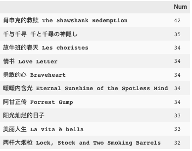

上表可以看出“短评小王子”最爱评价的前十部电影，右侧一栏是被评价的次数。上述信息可见代码：

```python
# 取出评价过100次以上的短评小王子
coolpeo_list = data_com_759.people.value_counts()[data_com_759.people.value_counts() >=100].index.tolist()
# 短评小王子的短评
coolpeo_com = data_com_759[data_com_759.people.apply(lambda x: x in coolpeo_list)]
# 取出短评小王子评价过的电影
coolpeo_movie_id = coolpeo_com.movie_id.value_counts().index.tolist()
coolpeo_item = data_item[data_item.movie_id.apply(lambda x: x in coolpeo_movie_id)]
coolpeo_item_com = pd.merge(coolpeo_item, coolpeo_com, how='right' ,on='movie_id')
# “短评小王子”最爱评价的前十部电影:
pd.DataFrame(coolpeo_item_com.movie_title.value_counts().head(10).values 
             ,index=coolpeo_item_com.movie_title.value_counts().head(10).index.values 
             , columns = ['Num'])
```

利用上述代码，替换相应电影item分类columns，就可以给出“短评小王子”最爱评价的其他信息，如排前十的国别：

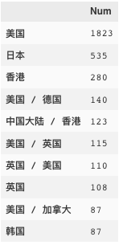

自然地，美国大片首当其冲，其次日本片子紧随其后。代码如下：

```python
pd.DataFrame(coolpeo_item_com.country.value_counts().head(10).values 
             ,index=coolpeo_item_com.country.value_counts().head(10).index.values 
             , columns = ['Num'])
```

更多的我也是懒得分析了。。。基本照猫画虎～～～

再如，可以得到不同电影类型的短评数：

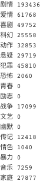

上表代码如下：

```python
l = ['genre_剧情', 'genre_爱情', 'genre_喜剧', 'genre_科幻',
       'genre_动作', 'genre_悬疑', 'genre_犯罪', 'genre_恐怖', 'genre_青春', 'genre_励志',
       'genre_战争', 'genre_文艺', 'genre_黑色幽默', 'genre_传记', 'genre_情色',
       'genre_暴力', 'genre_音乐', 'genre_家庭']
data_item_com = pd.merge(data_item, data_com, how='right' ,on='movie_id')
for i in l:
    print(i[-2:], data_item_com[data_item_com[i] ==1].shape[0])
```

### 通过短评来预测被评价电影是什么类型

接下来，我们就要根据其中“喜剧”和“犯罪”两类电影的短评构建分类模型，看是不是可以通过短评来预测被评价电影是什么类型。

```python
# 数据准备 ================================================
data_X = data_item_com[data_item_com.genre_喜剧 ==1]
data_F = data_item_com[data_item_com.genre_犯罪 ==1]

import jieba 
import pandas as pd 
import random

stopwords=pd.read_csv("../stopwords.txt",index_col=False,quoting=3
                      ,sep="\t",names=['stopword'], encoding='utf-8')
stopwords=stopwords['stopword'].values

def preprocess_text(content_lines,sentences,category): 
    for line in content_lines:
        try:
            segs=jieba.lcut(line)
            segs = filter(lambda x:len(x)>1, segs)
            segs = filter(lambda x:x not in stopwords, segs)
            sentences.append((" ".join(segs), category))
        except:
            print(line)
            continue

# 切词 ====================================================
import jieba 
import pandas as pd 
import random

stopwords=pd.read_csv("../stopwords.txt",index_col=False,quoting=3
                      ,sep="\t",names=['stopword'], encoding='utf-8')
stopwords=stopwords['stopword'].values

def preprocess_text(content_lines,sentences,category): 
    for line in content_lines:
        try:
            segs=jieba.lcut(line)
            segs = filter(lambda x:len(x)>1, segs)
            segs = filter(lambda x:x not in stopwords, segs)
            sentences.append((" ".join(segs), category))
        except:
            print(line)
            continue

sentences=[]
preprocess_text(data_X.content.dropna().values.tolist() ,sentences ,'喜剧')
preprocess_text(data_F.content.dropna().values.tolist() ,sentences ,'犯罪')
random.shuffle(sentences)       

# 切分训练集和测试集 ========================================
from sklearn.model_selection import train_test_split
x,y=zip(*sentences)
train_data,test_data,train_target,test_target=train_test_split(x, y, random_state=1234)
```

```python
"""
基于卷积神经网络的中文文本分类
"""
from __future__ import absolute_import
from __future__ import division
from __future__ import print_function

import argparse
import sys
import numpy as np
import pandas as pd
from sklearn import metrics
import tensorflow as tf

learn = tf.contrib.learn
FLAGS = None
# 文档最长长度
MAX_DOCUMENT_LENGTH = 100
# 最小词频数
MIN_WORD_FREQUENCE = 2
# 词嵌入的维度
EMBEDDING_SIZE = 20
# filter个数
N_FILTERS = 10 # 10个神经元
# 感知野大小
WINDOW_SIZE = 20
#filter的形状
FILTER_SHAPE1 = [WINDOW_SIZE, EMBEDDING_SIZE]
FILTER_SHAPE2 = [WINDOW_SIZE, N_FILTERS] 
# 池化
POOLING_WINDOW = 4
POOLING_STRIDE = 2
n_words = 0

def cnn_model(features, target):
    """
    2层的卷积神经网络，用于短文本分类
    """
    # 先把词转成词嵌入
    # 我们得到一个形状为[n_words, EMBEDDING_SIZE]的词表映射矩阵
    # 接着我们可以把一批文本映射成[batch_size, sequence_length,EMBEDDING_SIZE]的矩阵形式
    target = tf.one_hot(target, 15, 1, 0) #对词编码
    word_vectors = tf.contrib.layers.embed_sequence(features
                                                    ,vocab_size=n_words
                                                    ,embed_dim=EMBEDDING_SIZE
                                                    ,scope='words')
    word_vectors = tf.expand_dims(word_vectors, 3)
    
    with tf.variable_scope('CNN_Layer1'):
        # 添加卷积层做滤波
        conv1 = tf.contrib.layers.convolution2d(word_vectors
                                                ,N_FILTERS
                                                ,FILTER_SHAPE1
                                                ,padding='VALID')
        # 添加RELU非线性
        conv1 = tf.nn.relu(conv1) 
        # 最大池化
        pool1 = tf.nn.max_pool(conv1
                               ,ksize=[1, POOLING_WINDOW, 1, 1]
                               ,strides=[1, POOLING_STRIDE, 1, 1]
                               ,padding='SAME')
        # 对矩阵进行转置，以满足形状
        pool1 = tf.transpose(pool1, [0, 1, 3, 2])
    with tf.variable_scope('CNN_Layer2'):
        # 第2卷积层
        conv2 = tf.contrib.layers.convolution2d(pool1
                                                ,N_FILTERS
                                                ,FILTER_SHAPE2
                                                ,padding='VALID') 
        # 抽取特征
        pool2 = tf.squeeze(tf.reduce_max(conv2, 1), squeeze_dims=[1])
        
    # 全连接层
    logits = tf.contrib.layers.fully_connected(pool2, 15, activation_fn=None)
    loss = tf.losses.softmax_cross_entropy(target, logits) 
    # 优化器
    train_op = tf.contrib.layers.optimize_loss(loss
                                               ,tf.contrib.framework.get_global_step()
                                               ,optimizer='Adam'
                                               ,learning_rate=0.01)
    
    return ({
            'class': tf.argmax(logits, 1),
            'prob': tf.nn.softmax(logits)
    }, loss, train_op)

global n_words
# 处理词汇
vocab_processor = learn.preprocessing.VocabularyProcessor(MAX_DOCUMENT_LENGTH
                                                          ,min_frequency=MIN_WORD_FREQUENCE) 
x_train = np.array(list(vocab_processor.fit_transform(train_data)))
x_test = np.array(list(vocab_processor.transform(test_data)))
n_words=len(vocab_processor.vocabulary_) 
print('Total words:%d'%n_words)

cate_dic={'喜剧':0,'犯罪':1}
y_train = pd.Series(train_target).apply(lambda x:cate_dic[x] , train_target)
y_test = pd.Series(test_target).apply(lambda x:cate_dic[x] , test_target)
# Total words:18613
```

```python
# 构建模型
classifier=learn.SKCompat(learn.Estimator(model_fn=cnn_model))

# 训练和预测
classifier.fit(x_train,y_train,steps=1000) 
y_predicted=classifier.predict(x_test)['class'] 
score=metrics.accuracy_score(y_test,y_predicted) 
print('Accuracy:{0:f}'.format(score))
```


CNN基模型在测试集准确率73.4%，马马虎虎吧～ 当然，我们也可以自定义预测啦：

```python
def pred(commment):
    sentences=[]
    preprocess_text([commment] ,sentences, 'unknown')
    x,y=zip(*sentences)
    x_tt = np.array(list(vocab_processor.transform([x[0]])))
    
    if classifier.predict(x_tt)['class'][0]:
        print('犯罪片！')
    else:
        print('喜剧片！')
```

效果大概是这样子滴：

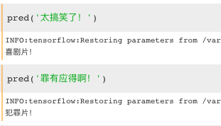

在这个idea的启发下，还可以构建各种各样的模型，如根据短评判断电影的导演是谁等等～ ～


（完）


## 小结

暂无


REF——情感分析：

http://blog.csdn.net/yan456jie/article/details/52242790

http://www.jianshu.com/p/4cfcf1610a73?nomobile=yes
